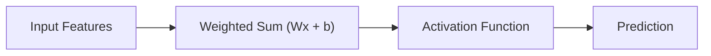

# 🧠 Lecture 1 - Perceptron (Revision)

> **Goal:** Understand the building block of every Neural Network.

---

## 📌 One Line Summary

> A **Perceptron** is the simplest neural network that computes a weighted sum of inputs, adds a bias, applies an activation function, and produces a prediction.

---

# 🏗️ Architecture



---

# 🧮 Mathematical Formula

### Weighted Sum

```text
z = W₁X₁ + W₂X₂ + ... + WₙXₙ + b
```

or

```text
z = Wx + b
```

### Prediction

```text
ŷ = f(z)
```

where

- `W` → Weights
- `X` → Input Features
- `b` → Bias
- `f()` → Activation Function

---

# ⚙️ Components

| Component | Purpose |
|-----------|----------|
| Input | Features given to the model |
| Weight | Determines direction and magnitude of each feature's influence |
| Bias | Allows the decision boundary to shift away from the origin |
| Weighted Sum | Linear combination of inputs |
| Activation Function | Converts weighted sum into prediction |

---

# 🎯 What does a Weight represent?

A weight determines:

- Direction of influence
- Magnitude of influence

Positive Weight

```text
Feature ↑
      ↓
Prediction ↑
```

Negative Weight

```text
Feature ↑
      ↓
Prediction ↓
```

Large magnitude means the feature has a stronger influence.

---

# 🎯 Why do we need Bias?

Without bias

```text
Decision Boundary

Always passes through origin
```

Bias allows

```text
Decision Boundary

Can move anywhere
```

Without bias, many simple relationships cannot be learned.

---

# ⚡ Activation Function

Perceptron uses the **Step Function**

```text
if z > 0
    output = 1
else
    output = 0
```

Purpose:

Convert a continuous value into a binary decision.

---

# 🚫 Limitations

A perceptron **cannot**:

- Learn non-linear relationships
- Solve XOR
- Recognize images
- Understand language
- Learn using Gradient Descent (Step Function is non-differentiable)

---

# ❓ Why is Perceptron still Linear?

Although the Step Function looks non-linear,

the weighted sum

```text
z = Wx + b
```

creates only **one linear decision boundary (hyperplane)**.

Therefore,

adding a Step Function **does not increase expressive power**.

---

# 💡 Representation Learning

Traditional Machine Learning

```text
Raw Data
    │
    ▼
Feature Engineering (Human)
    │
    ▼
Machine Learning Model
```

Deep Learning

```text
Raw Data
    │
    ▼
Neural Network
    │
    ▼
Learns Features Automatically
    │
    ▼
Prediction
```

This automatic feature extraction is called **Representation Learning**.

---

# 🤖 Connection to GPT

Every neuron inside GPT still performs the same basic computation.

| Perceptron | GPT |
|------------|-----|
| Input | Token Embeddings |
| Weight | Weight Matrix |
| Bias | Bias Vector |
| Step Function | GELU |
| Output | Hidden Representation |

The idea is identical.

Only the activation function has changed.

---

# 📝 Interview Cheat Sheet

### Q1. Why can't Linear Regression recognize faces?

Because it learns only linear relationships and cannot automatically extract complex features from raw pixels.

---

### Q2. What is Representation Learning?

The ability of a neural network to automatically learn useful features from raw input data.

---

### Q3. Why is Bias important?

Bias shifts the decision boundary away from the origin, allowing the model to learn a wider range of functions.

---

### Q4. Why is Perceptron still linear?

Because its weighted sum is linear and the Step Function only thresholds the output without creating complex decision boundaries.

---

### Q5. Can a Perceptron solve XOR?

No.

XOR is not linearly separable and requires multiple decision boundaries.

---

# 🧩 First-Principles "Why?" Chain

```text
Why can't Linear Regression recognize faces?
            │
            ▼
Because faces contain complex non-linear relationships.
            │
            ▼
Why?
            │
            ▼
Pixels alone are not meaningful features.
            │
            ▼
How do we solve that?
            │
            ▼
Neural Networks learn features automatically.
            │
            ▼
What is the simplest Neural Network?
            │
            ▼
Perceptron.
            │
            ▼
Why isn't Perceptron enough?
            │
            ▼
Because it is still a linear classifier.
```

---

# 📚 Key Takeaways

- Perceptron is the foundation of all neural networks.
- It performs a weighted sum followed by an activation function.
- It introduced the concepts of weights, bias and activation.
- It is still a linear classifier.
- It cannot solve non-linear problems like XOR.
- Modern Deep Learning builds on the same idea using differentiable activation functions and multiple hidden layers.

---

# 🚀 Next Lecture

➡️ Multi-Layer Neural Networks

Topics:

- Hidden Layers
- Why Multiple Layers?
- XOR Problem
- Expressive Power
- Universal Approximation
